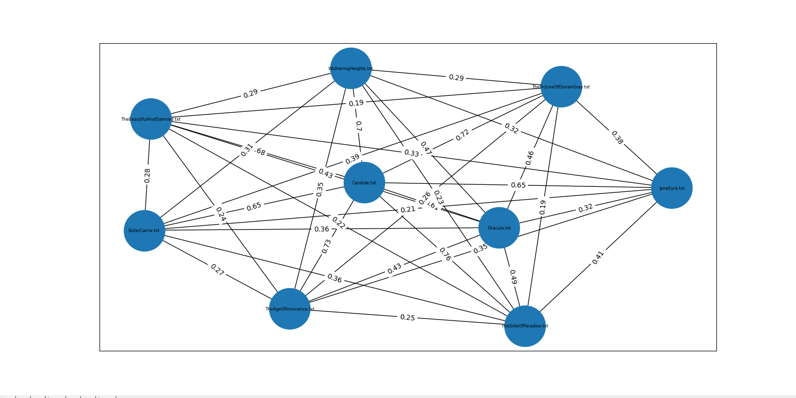
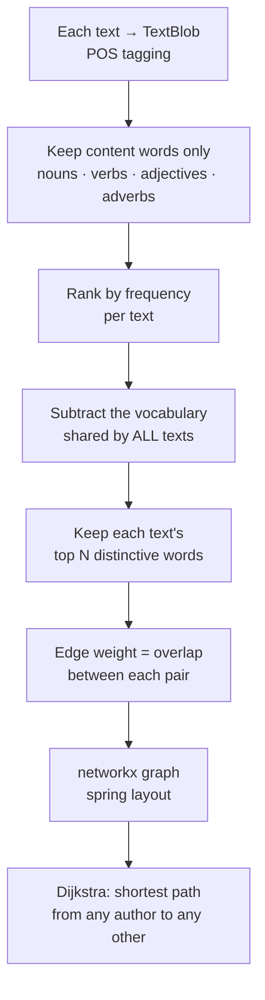
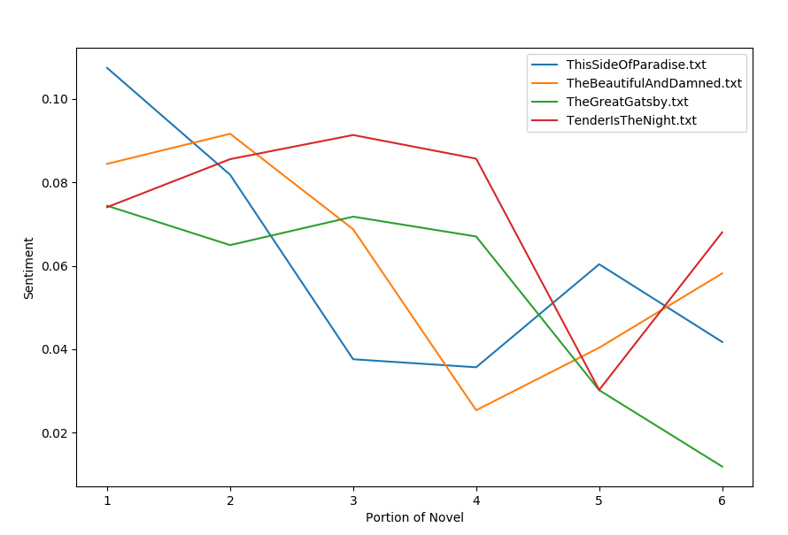

# Prose Similarities

Compares novels by their prose alone — no genre labels, no metadata — and draws the
result as a graph of who writes like whom.



## The idea

Every novel in English shares most of its vocabulary with every other novel in
English. *Said*, *man*, *little*, *know* — that common layer is the bulk of the text
and it tells you nothing, because everyone uses it.

So throw it away. What's left after you subtract the words *everybody* uses is the
vocabulary that actually distinguishes one writer from another, and two books that
still overlap after that subtraction have something real in common.



That last step is the fun one. Because edges carry weight, you can ask for the
*route* between two writers who share almost nothing directly — and get back the
chain of intermediate books that connects them.

## Also in here: sentiment over a novel

`analysis.py` carries a second, separate line of work — sentiment plotted across a
book, and across several books by one author:



| Function | What it does |
|---|---|
| `build_likeness_graph(dir)` | The graph above. `show_graph=True` to draw, `shortest_path=True` to route |
| `sentiment_analysis(novel)` | Polarity across one text, by paragraph or sentence |
| `sentiment_by_parts(novel, scale, jump)` | Polarity over *overlapping windows* — `scale` sets window size, `jump` the stride |
| `sentiment_multiple_novels(novels, parts)` | Several books on one axis, normalized to the same number of parts |

The windowing in `sentiment_by_parts` is the fix for
[Novel_NLP_Analyzer](https://github.com/2016judea/Novel_NLP_Analyzer), where
scoring paragraph by paragraph produced pure noise. Overlapping windows smooth it
into something you can actually read.

## The corpus

Plain text from Project Gutenberg, sorted into directories — the directory *is* the
comparison set:

```
novels/classics/      Candide · Dracula · Jane Eyre · Wuthering Heights
                      Sister Carrie · Dorian Gray · The Age of Innocence
novels/fitzgerald/    all four Fitzgerald novels — for within-author comparison
poetry/romantics/     Keats · Wordsworth · Byron
poetry/modernists/    Eliot · Pound · Dickinson · Yeats
```

## Running it

```bash
pip install -r requirements.txt
python -m textblob.download_corpora
python main.py
```

`main.py` points at `poetry/testing/` by default. Change the path to run a different
set; drop in your own `.txt` files and they'll be picked up automatically.

Be patient — POS-tagging a full novel with TextBlob is slow, and the graph tags
every text in the directory before it draws anything.

## Where this went

This is the direct ancestor of
**[literature-mutations](https://github.com/2016judea/literature-mutations)**, which
takes the same core intuition — *subtract the shared layer, cluster on what's left* —
and does it properly at scale: TF-IDF instead of raw frequency, a 345-novel
cross-referenced canon instead of a folder, k-nearest-neighbor edges instead of
all-pairs, and Louvain community detection instead of eyeballing a spring layout.

It recovers the genre system of English fiction, and the clusters check out against
held-out labels. The idea was right here; it needed better machinery.
